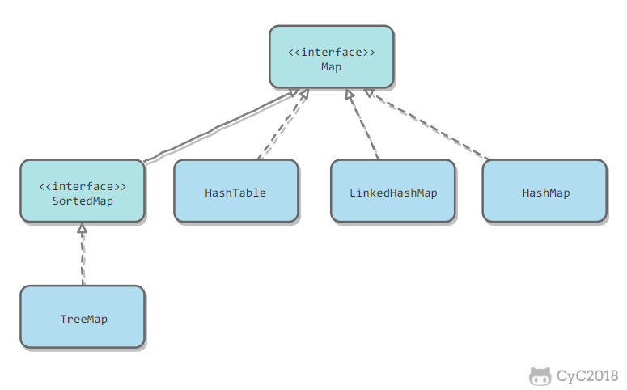

# 一、概要
容器主要包含了Collection和Map两种，Collection存储着对象的集合，而Map存储着健值对（两个对象）的映射表
## Collection

### 主要方法

### Collections接口常见的方法
-add(element),add(index,element),addAll(element),addAll(index,element) remove(object|index) size() clear() contains() isEmpty()  iterator()

### 1、List
- List转数组 <T>T[] toArray(T[] a)
#
	ArrayList<String> list = new ArrayList<String>();
	String[] strArr = list.toArray(new String[] {});
- 数组转List: <T> List asList <T...a>;**(返回的集合我们不能对其增删元素，否则会抛出异常，并且对集合的元素进行修改会影响数组对应的元素)**
#
	String[] strings={"a","b","c"};
	List<String> list = Arrays.asList(strings);
- 排序
#	
	内置的Collections.sort(list)
	1、相关类实现Comparable接口的compareTo方法,再调用Collections.sort(list)
	2、实现一个实现了Comparator接口的compare方法的比较类 x;再调用 Collections.sort(list,x)

[类实现Comparable接口的compareTo方法](https://www.cnblogs.com/ltb6w/p/7954839.html)

[实现一个实现了Comparator接口的compare方法的比较类](https://blog.csdn.net/without_scruple/article/details/78466847)

**compareTo方法返回的int类型比较结果为，当返回值为正，当前对象比比较对象大；返回值为负，则当前对象比比较对象小；零表示两个对象相等**

**Comparator接口中的compare()方法接受两个同类型的不同对象的比较(前一个相当于当前对象，后一个相当于比较对象)**

### List边遍历边删除
使用iterator的remove方法来边遍历边删除

	public static void delete(Hashset<String> hashSet){
		Iterator<String> iterator =hashSet.iterator();
		while (iterator.hasNext()){
			String s= iterator.next();
			if (s.equals("xxx")){
				iterator.remove();
			}
		}
	}

### 2、Set
	Set<Integer> test = new TreeSet<>();TreeSet会将里面的元素默认排序
### 3、Map
	put(K,V),get(K),putAll(map),keySet(),values(),size(),remove(k),isEmpty(),
	clear(),containsKey(K),containsValue(V), equals(map):判断两个Set集合中的元素是否相同,
	Set<Map.Entry<K,V>> entrySet():返回map到一个Set集合中，形式为K=V
**map的几种遍历方式**
	
	Map<String,String> map = new HashMap<String,String>();
	for (Map.Entry<String,String> entry:map.entrySet()){
		String key = entry.getKey();
		String value = entry.getValue();
	}
	
	for (String key:map.keySet()){
		String value=map.get(key);
	}

	Iterator<String> iter =map.keySet().iterator();
	while(iter.hasNext()){
		String key = iter.next();
		String value = map.get(key);
	}
	
	Iterator<Entry<String,String>> iter = map.entrySet().iterator();
	Map.Entry<String,String> entry;
	while(iter.hasNext()){
		entry = iter.next();
		String value=entry.getValue();
	} 
	

### 1.set
- TreeSet:基于红黑树实现，支持有序性操作，例如根据一个范围查找元素的操作，但是查找效率不如HashSet, HashSet查找的时间复杂度为O(1),TreeSet则为O(logN)
- HashSet:基于哈希表实现，支持快速查找，但不支持有序性操作。并且失去了元素的插入顺序信息，也就是说使用Iterator遍历HashSet得到的结果是不确定的。
- LinkedHashSet:具有HashSet的查找效率，且内部使用双向链表维护元素的插入顺序。
### 2.List
- ArrayList:基于动态数组实现，支持随机访问
- Vector：和ArrayList类似，但它是线程安全的
- LinkedList：基于双向链表实现，只能顺序访问，但是可以快速地在链表中间插入和删除元素。不仅如此，LinkedList还可以用作栈、队列和双向队列
### 3.Queue
- LinkedList:可以使用它来实现双向队列
- PriorityQueue:基于堆结构实现，可以用它来实现优先队列
## Map

- TreeMap:基于红黑树实现的
- HashMap:基于哈希表实现的
- HashTable:和HashMap类似，但它是线程安全的，但它是遗留类，不应该去使用它。可以使用ConcurrentHashMap来支持线程安全。
- LinkedHashMap:使用双向链表来维护元素的顺序，顺序为插入顺序或者最近最少使用（LRU）顺序。
# 容器中的设计模式
## 迭代器模式

Collection继承了Iterable接口，其中的iterator()方法能够产生一个Iterator对象，通过该对象就可以迭代遍历Collection中的元素。
	
	List<String> list = new ArrayList<>();
	list.add("a");
	list.add("b");
	for (String item : list){
		System.out.println(item);
	}

## 适配器模式
java.util.Arrays的asList()可以把数组类型转换为List类型，需要注意的是asList()的参数为泛型的变长参数，不能使用基本类型数组作为参数，只能使用相应的包装类型数组。

	Integer[] arr = {1,2,3};
	List list = Arrays.asList(arr);
	List list = Arrays.asList(1,2,3);

# Java容器的源码分析
## ArrayList
## 1、概览
因为ArrayList是基于数组实现的，所以支持快速随机访问。RandomAccess接口标识着该类支持快速随机访问

	public class ArrayList<E> extends AbstractList<E>
								implements List<E>,RandomAccess,Cloneable,java.io.Serializable
数组的默认大小为10
	
	private static final int DEFAULT_CAPACITY=10;

## 2、扩容
添加元素时使用ensureCapacityInternal()方法来保证容量足够，如果不够时，需要使用grow()方法进行扩容，新的容量大小为旧容量的1.5倍:oldCapacity + (oldCapacity >> 1)

扩容操作需要调用Arrays.copyOf()把原数组整个复制到新数组中，操作代价比较高，因此最好在创建ArrayList对象时就指定大概的容量大小，减少扩容操作的次数。

## 3.删除元素
需要调用System,arraycopy()将index+1后面的元素都复制到index位置上，时间复杂度为O(N),代价高

## 4.Fail-Fast
modCount 用来记录ArrayList结构发生变化的次数。结构发生变化是指添加或者删除至少一个元素的所有操作，或是调整内部数组的大小，仅仅只是设置元素的值不算结构发生变化。

在进行序列化或者迭代等操作时，需要比较操作前后modCount是否改变，如果改变了需要抛出ConcurrentModificationException

## 5.序列化
ArrayList实现了writeObject()和readObject()来控制只序列化数组中有元素填充那部分内容。

序列化时需要使用ObjectOutputStream的writeObject()将对象转换为字节流并输出。而writeObject()方法在传入的对象存在writeObject()的时候会去反射调用该对象的writeObejct()来实现序列化

	ArrayList list = new ArrayList();
	ObjectOutputStream oos = new ObjectOutputStram(new FileOutputStream(file));
	oos.writeObject(list);
## Vector
实现与ArrayList类似，但是使用了synchronized进行同步。每次扩容为原数组的两倍。
## Vector与ArrayList的比较
- Vector是同步的，因此开销就比ArrayList来的大，访问速度慢。
- Vector每次扩容请求其大小的2倍，而ArrayList是1.5倍
## Vector第替代方案:
1.使用Collections.synchronizedList()得到一个线程安全的ArrayList
	List<String> list = new ArrayList<>();
	List<String> synList = Collections.synchronizedList(list);
2.也可以使用concurrent并发包下的CopyOnWriteArrayList类
	List<String> list = new CopyOnWriteArrayList<>();
## CopyOnWriteArrayList
## 读写分离
写操作在一个复制的数组上进行，读操作还是在原数组中进行，读写分离，互不影响。

写操作需要加锁，防止并发写入时导致写入数据丢失

写操作结束之后需要把原始数组指向新的复制数组

## 适用场景
CopyOnWriteArrayList在写操作的同时允许读操作，适合多读少写的场景，不适用于内存敏感以及对实时性要求很高的场景
## LinkedList
## 1.概览
基于双向链表的实现

	private static class Node<E>{
		E item;
		Node<E> next;
		Node<E> prev;
每个链表存储了first和last指针:
	transient Node<E> first;
	transient Node<E> last;
## HashMap
## 1.存储结构

内部包含了一个Entry类型的数组table

	transient Emtry[] table;
Entry 存储着键值对，还有哈希值和下一个节点的值。数组中的每一个位置被当成一个桶，每个桶存放着一个链表，数组中每个元素是链表的头结点。HashMap使用拉链法来解决冲突。
## 拉链法的工作原理（类似于解决散列表冲突的基于链表的邻接表)

	HashMap<String, String> map = new HashMap<>();
	map.put("K1","V1");
	map.put("K2","V2");
	map.put("K3,"V3");
步骤：

- 新建一个HashMap,默认大小为16
- 除留余数法得到的桶下标为 key % 16(比如说《K1,V1》键值对，先计算K1的hashCode作为key，再使用除留余数法)
- 有冲突的每次插在链表的头部(头插法)
查找需要分成两步进行：
- 计算键值对所在的桶;
- 在链表上顺序查找，时间复杂度显然和链表的长度成正比

HashMap允许插入键为null的键值对，但是因为无法调用null的hashCode()方法，所以只能强制指定第0个桶存放键为null的键值对
## 2.扩容基本原理
假设HashMap的table长度为M，需要存储的键值对数量为N,平均查找次数的复杂度为O(N/M)
动态扩容方法来根据当前N的值来调整M值，使得空间效率和时间效率都能得到保证。

和扩容相关的参数主要有:

|参数|含义|
|:--:|:--:|
|capacity|table的容量大小，默认为16，需要保证其是2的n次方|
|size|当前键值对的数量|
|threshold|size的临界值，当size大于等于threshold就必须进行扩容操作|
|loadFactor|装载因子，table能够使用的比例，threshold=(int)(newCapacity*loadFactor)|

## 与Hashtable的比较
- Hashtable使用synchronized来进行同步
- HashMap可以插入键为null的Entry
- HashMap的迭代器是fail-fast迭代器
- HashMap不能保证随着时间的推移Map中的元素次序是不变的                                                                                                                                                                                                                                                                                                                                                                                                                                                                                                                                                                     

## ConcurrentHashMap
## 1.存储结构
ConcurrentHashMap和HashMap实现上类似，最主要的差别是ConcurrentHashMap采用了分段锁(Segement),每个分段锁维护着几个桶(HashEntry)，多个线程可以同时访问不同分段锁上的桶，从而使其并发度更高

## LinkedHashMap
继承自HashMap，因此具有和HashMap一样的快速查找特性，内部维护了一个双向链表，用来维护插入顺序或者LRU顺序

