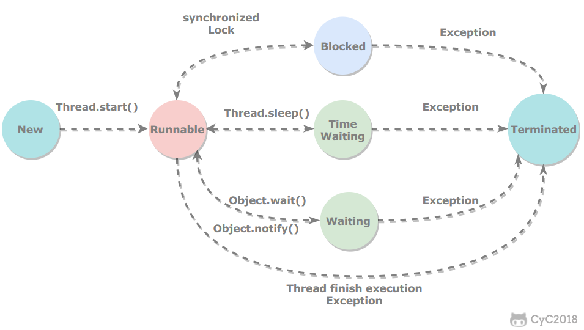

# Java并发
## 一、线程状态切换

## 新建(New)
创建后尚未启动
## 可运行(Runnable)
可能正在运行，或者也可能正在等待CPU时间片
包含了操作系统线程状态中的Running和Ready
## 阻塞(Blocked)
## 无限期等待(Waiting)
等待其他线程显示地唤醒,否则不会被分配CPU时间片

|进入方法|退出方法|
|:--:|:--:|
|没有设置Timeout参数的Object.wait()方法|Object.notify()/Object.notifyAll()|
|没有设置Timeout参数的Thread.join()方法|被调用的线程执行完毕|
|LockSupport.park()方法|LockSupport.unpark(Thread)|
## 限期等待(Time Waiting)
睡眠(sleep)和挂起(wait)是用来描述行为的，而阻塞和等待是用来描述状态的

阻塞和等待的区别在于，阻塞是被动的，它在等待获取一个排它锁。而等待是主动的

|进入方法|退出方法|
|:--:|:--:|
|Thread.sleep()方法|时间结束|
|设置Timeout参数的Object.wait()方法|时间结束/Object.notify()/Object.notifyAll()|
|设置Timeout参数的Thread.join()方法|时间结束/被调用的线程执行完毕|
|LockSupport.parkNanos()方法|LockSupport.unpark(Thread)|
|LockSupport.parkUntil()方法|LockSupport.unpark(Thread)|
## 死亡(Terminated)
可以是线程结束任务之后自己结束，或者是产生了异常而结束。

## 二、使用线程
有三种使用线程的方法：
- 实现Runnable接口
- 实现Callable接口
- 继承Thread类
### 实现Runnable接口
	 public class MyRunnable implements Runnable{
		public void run(){}
	}
	public static void main(String[] args){
		MyRunnable instance =new MyRunnable();
	 	Thread thread =new Thread(instance);
	}
### 实现Callable接口
与Runnable相比，Callable有返回值并且返回值通过FutureTask进行封装

	public class MyCallable implements Callable<Integer>{
		public Integer call(){
			return 123;
		}
	}
	public static void main(String[] args) throws ExecutionException, InterruptedException{
		MyCallable mv = new MyCallable();
		FutureTask<Integer> ft = new FutureTask<>(mc);
		Thread thread = new Thread(ft);
		thread.start();
		System.out.println(ft.get());
	}
### 继承Thread类
	public class MyThread extends Thread{
		public void run(){
	}
	}
	public static void main(String[] args){
		MyThread mt = new MyThread();
		mt.start();
	}
### 实现接口和继承Thread
实现接口更优：因为Java不支持多重继承，继承Thread类就无法继承其他类，继承Thread类开销过大。
## 三、基础线程机制
### 使用线程池的好处:
- 减少在创建和销毁线程上所花的时间以及系统资源的开销
- 如不使用线程池，有可能造成系统创建大量线程而导致消耗完系统内存
### 线程池的参数及其代表意义
	ThreadPoolExecutor(int corePoolSize, int maximumPoolSize, 
	long keepAliveTime, TimeUnit unit, BlockingQueue<Runnable> workQueue,
	ThreadFactory threadFactory, RejectedExecutionHandler handler)

**corePoolSize:** 核心池的大小。当线程池中的线程数目达到corePoolSize后，就会把到达的任务放到缓存队列中

**maximumPoolSize:** 线程池的最大线程数

**keepAliveTime:** 表示线程没有任务执行时最多保持多久时间会终止

**unit:** 参数keepAliveTime的时间单位

**workQueue:** 一个阻塞队列，用来存储等待执行的任务。线程池的排队策略与BlockingQueue有关

**threadFactory:** 线程工厂，主要用来创建线程

**handler:**表示当拒绝处理任务时的策略

### Executor

	ExecutorService	 executorService = Executors.newCachedThreadPool();//Executors的相关静态方法返回一个 ExecutorService接口的实现类ThreadPoolExecutor
	
Executor管理多个异步任务的执行，无需程序员显示地管理线程的生命周期。
三种Executor:
- CachedThreadPool：一个任务创建一个线程
- FixedThreadPool：所有任务只能使用固定大小的线程
- SingleThreadExecutor：相当于大小为1的FixedThreadPool
### Daemon
守护线程是程序运行时在后台提供服务的线程，不属于程序中不可或缺的部分。当所有非守护线程结束时，程序也就终止了，同时会杀死所有的守护线程。

main()属于非守护线程，在线程启动之前使用setDaemon()方法可以将一个线程设置为守护线程。

### InterruptedException
通过调用一个线程的Interrupt()来中断该线程，如果该线程处于阻塞、限期等待或者无限期等待状态，那么就会抛出InterruptedExeception,从而提前结束该线程。但是不能中断I/O阻塞和synchronized锁阻塞。
## 四、互斥同步
Java提供了两种锁机制来控制多个线程对共享资源的互斥访问，第一个是JVM实现的synchronized，而另一个是JDK实现的ReentrantLock.
### synchronized
同步一个代码块或者同步一个实例方法，只是作用于同一个实例对象，所有同步的代码块和实例方法必须串行执行。

同步一个类或静态方法，则作用于整个类。

### ReentrantLock
ReentrantLock是java.util.concurrent(J.U.C)包中的锁

### 两者的比较
- synchronized是JVM实现的，而ReentrantLock是JDK实现的
- ReentrantLock可中断，而syhchronized不行
## 五、线程之间的协作
### join()
在线程中调用另一个线程的join()方法，会将当前线程挂起，去执行另一个线程。
### wait() notify() notifyAll()
调用wait()使得线程等待某个条件满足。用notify()或notifyAll()来唤醒挂起的线程。它们都是属于Object的一部分而不属于Thread。只能在同步方法或者同步控制块中使用。

使用wait()挂起期间，线程会释放锁。因为不释放的话，其他线程就无法进入其他同步方法去notify唤醒线程，从而造成死锁。

### wait()和sleep()的区别
- wait()是Object的方法，而sleep()是Thread的静态方法
- wait()会释放锁，而sleep()不会

### await() signal() singal()
用Condition类结合ReentrantLock来实现等待与通知
## 六、J.U.C
### CountDownLatch
维护了一个计数器cnt，每次调用了countDown()方法会让计数器的值减1，减到0
的时候，那些因为调用了await()方法而在等待的线程就会被唤醒。
### CyclicBarrier
与CountDownLatch类似，都是用计数器来维护等待的线程何时被唤醒，唯一的区别在于CyclicBarrier的计数器可以通过调用reset()方法循环使用。
### Semaphore
控制对互斥资源的访问线程数
### FutureTask
FutureTask实现了RunnableFuture接口，该接口继承Runnable和Future接口，这使得FutureTask既可以当做一个任务执行，也可以有返回值
### Blockingqueue
- LinkedBlockingQueue、ArrayBlockingQueue、PriorityBlockingQueue take&put
### Forkjoin
主要用于并行计算中，把大的计算任务拆分成多个小任务并行计算.ForkJoin使用ForkJoinPool来启动