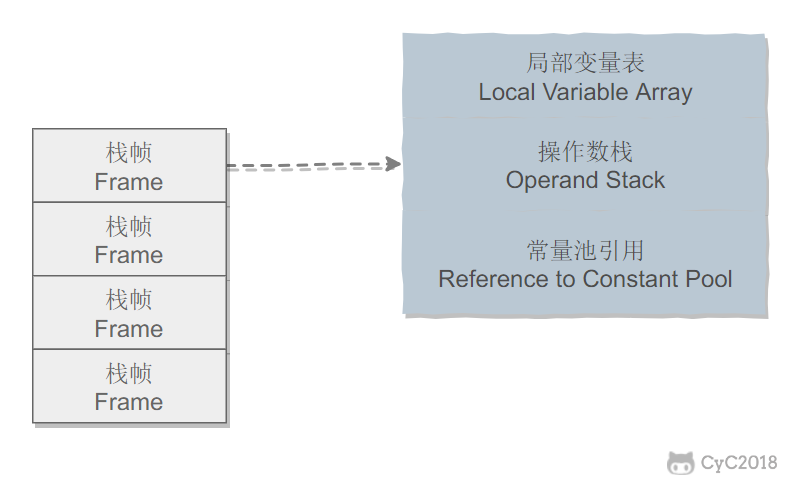

## 一、运行时数据区域

## 程序计数器
记录正在执行的虚拟机字节码指令的地址（如果正在执行的是本地方法则为空）

程序计数器是一块较小的内存空间，它的作用是当前线程所执行的字节码的信号指示器(偏移地址)。每一个线程都有一个独立的程序技术器(线程私有的)
## Java虚拟机栈
每个Java方法在执行的同时会创建一个栈帧用于存储局部变量表、操作数栈、动态链接、方法出口、常量池引用等信息(没有类信息，类信息是在方法区中)。从方法调用直至执行完成的过程，对应着一个栈帧在Java虚拟机栈中入栈和出栈的过程。

## 本地方法栈
本地方法栈是为本地方法服务的。本地方法一般使用的是其他语言(C、C++或汇编语言等)编写的，并且被编译为基于本机硬件和操作系统的程序，对待这些方法需要特别处理。

## 堆
所有对象都在这里分配内存，是垃圾收集的主要区域("GC堆")。堆不需要连续内存，并且可以动态增加其内存，对于绝大多数应用来说，这块区域是JVM所管理的内存中最大的一块，其线程共享并且主要存放对象实例和数组。

## 方法区
属于共享内存区域，用于存放已被加载的类信息、常量、静态变量、即时编译器后的代码等数据。

## 运行时常量池
运行时常量池是方法区的一部分。
Class文件中的常量池（编译器生成的字面量和符号引用）
## 直接内存
可以直接对这块内存进行操作，避免了堆内存和堆外内存来回之间的拷贝