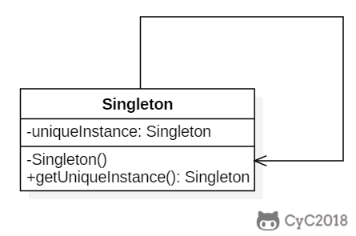

# 一、创建型
## 1.单例(Singleton)

### I 懒汉式-线程不安全
	public class Singleton{
		private static Singleton uniqueInstance;
		pruvate Singleton(){}
		public static Singleton getUniqueInstance(){
				if (uniqueInstance == null){
					uniqueInstance = new Singleton();
				}
				return uniqueInstance;
		}
	}
这个实现是线程不安全的，因为多个线程能同时进入 if (uniqueInstance == null)进行实例化

### II 饿汉式线程安全
- 直接实例化，但直接实例化丢失了延迟实例化带来的节约资源的好处
#
	private static Singleton uniqueInstance = new Singleton();

- 使用synchronized:当一个线程进入该方法后，其他试图进入该方法的线程必须等待，即时对象已经被实例化了也要等待，性能有问题。
#
	public static synchronized Singleton getUniqueInstance(){
		if (uniqueInstance == null){
			unqiueInstance = new Singleton();
		}
		return uniqueInstance;
	}

### III 双重校验锁-线程安全
加锁操作只需要对实例化那部分的代码进行，只有当uniqueInstance没有被实例化时，才需要进行加锁。在加锁的代码块里也需要判断是否有实例对象。
#
	public class Singleton{
		private volatile static Singleton uniqueInstance;
		private Singleton(){}
		public static Singleton getUniqueInstance(){
			if (uniqueInstanc == null){
				sychronized(Singleton.class){
					if (uniqueInstance == null){
						uniqueInstance = new Singleton();
					}
				}
			}
			return uniqueInstance;
		}
	   }

声明uniqueInstance采用volatile关键字修饰是正确的，uniqueInstance=new Singleton()这段代码分三步执行:

- 1.为unqiueInstance分配内存空闲
- 2.初始化uniqueInstance
- 3.将uniqueInstance指向分配的内存地址

由于JVM具有指令重排的特性，执行顺序可能发生改变，在单线程的情况下没有什么问题。但如果是多线程的情况下，会导致一个线程获得还没有初始化的实例。

使用volatile可以禁止JVM的指令重排，保证在多线程环境下也能正常运行。

### IV 静态内部类实现
	public class Singleton{
		private Singleton(){}
		private static class SingletonHolder{
			private static final Singleton INSTANCE = new Singleton();
		}
		public static Singleton getUniqueInstance(){
			return SingletonHolder.INSTANCE;
		}
		}
当Singleton类被加载时，静态内部类SingletonHolder没有被加载进内存。只有当调用getUniqueInstance()方法从而触发SingletonHolder.INSTANCE时SingletonHolder才会被加载进来。这种方式不仅具有延迟初始化的好处，而且由JVM提供了对线程安全的支持。
### V 枚举实现
	public enum Singleton{
		INSTANCE;
		private String objName;
		public String getObjName(){
			return objName;
		}
		public void setObjName(String objName){
			this.objName=objName;
		}
	}
	
该实现可以防止反射攻击，受到JVM保证只会实例化一次。在其他实现中，通过setAccessible()方法可以将私有构造函数的访问级别设置为public，然后调用构造函数从而实例化对象。

## 2、简单工厂(Simple Factory)
简单工厂把实例化操作单独放到一个类中，这个类就成为简单工厂类

	
	public interface Product{
	}
	public class ConcreteProduct implements Product{
	}
	public class ConcreteProduct1 implements Product{
	}
	public class ConcreteProduct2 implements Product{
	}

	public class SimpleFactory{
	      public Product createProduct(int type){
				if (type==1){
					return new ConcreteProduct1();
				}else if (type==2){
					return new ConcreteProduct2();
				}
				return new ConcreteProduct();
			}
	}

	public class Client{
		public static void main(String[] args){
			SimpleFactory simpleFactory = new SimpleFactory();
			Product product = simpleFactory.createProduct(1);
		}
	}

## 3、工厂方法(Factory Method)
在简单工厂中，创建对象的是另一个类，而在工厂方法中	，是由子类来创建对象。

	public abstract class Factory{
        abstract public Product factoryMethod();
		public void doSomething(){
			Product product = factoryMethod();
		}
	}
	
	public class ConcreteFactory extends Factory{
		public Product factoryMethod(){
			return new ConcreteProduct();
		}
	}
	public class ConcreteFactory1 extends Factory{
		public Product factoryMethod(){
			return new ConcreteProduct1();
		}
	}
	public class ConcreteFactory2 extends Factory{
		public Product factoryMethod(){
			reutrn new ConcreteProduct2();
		}
	}