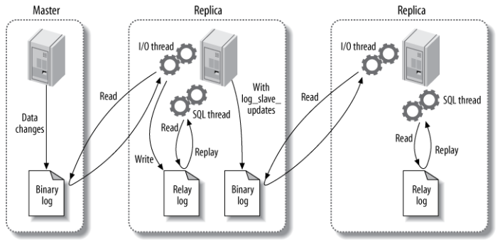

# 数据库知识
## 索引
### B+ Tree原理
#### 数据结构

B树是一颗平衡查找树，并且所有叶子节点位于同一层。

B+树是基于B树和叶子节点顺序访问指针进行实现的，它具有B树的平衡性，并且通过顺序访问指针来提高区间查询的性能

在B+树中，一个节点的key从左到右非递减排序，如果某个指针的左右相邻key分别是keyi和keyi+1，且不为空，则该指针指向节点的key大于等于keyi且小于等于keyi+1 如图所示：

#### 操作
进行查找时，首先在根节点进行二分查找，找到一个key所在的指针，然后递归地在指针所指向的节点进行查找。直到查找到叶子节点，然后在叶子节点上进行二分查找，找出key所对应的data

插入删除操作会破坏平衡树的平衡性，因此在插入删除操作之后，需要对树进行一个分裂、合并、旋转等操作来维护平衡性。

### 红黑树
是一种平衡的二叉查找树

红黑树的特性：

- 每个节点为黑色或者是红色
- 根节点是黑色
- 每个叶子节点（NIL）是黑色（叶子节点是指为空的节点）
- 如果一个节点是红色，则其子节点必须是黑色
- 从一个节点到该节点的子孙节点的所有路径上包含相同数目的黑节点

### B+树与红黑树的比较
文件系统及其数据库系统普遍采用 B+树作为索引结构的原因：

#### 1、更少的查找次数

平衡树查找操作的时间复杂度和树高有关 O(h)=O(logdN)其中d为每个节点的出度。

红黑树的出度为2，而B+树的出度一般都非常大，所以红黑树的树高h明显要比B+树大的非常多，查找次数也多

#### 2、利用磁盘预读特性
为了减少磁盘I/O操作，磁盘往往不是严格按需读取，而是每次都会预读。预读过程中，磁盘进行顺序读取，顺序读取不需要进行磁盘寻道，并且只需要很短的磁盘旋转时间，速度会非常快，B+树的特点可以通过顺序访问指针来满足预读需求。

### 聚簇索引和非聚簇索引
聚簇索引就是在同一棵B树中保存了索引列和具体数据，在聚簇索引中实际数据保存在叶子页中，中间的节点页保存指向下一层页面的指针。一个表只能有一个聚簇索引，一般将主键作为聚簇索引列，因为一个表中数据的存放方式只有一种。

非聚簇索引，又叫二级索引。二级索引的叶子节点中保存的不是指向行的物理指针，而是行的主键值。当通过二级索引查找行，存储引擎需要在二级索引中找到相应的叶子节点，获得行的主键值，然后使用主键去聚簇索引中查找数据行，这需要二次B-Tree查找.

## 覆盖索引
如果一个索引包含所有需要查询的字段的值，就称之为覆盖索引。InnoDB存储引擎中如果不是主键索引，叶子节点存储的是主键+列值，最终还是要“回表”的，也就是要通过主键再查找一次，这样导致速度慢，覆盖索引避免了“回表”操作。

## MySQL中的索引：
- B+树索引
- 哈希索引：哈希索引能以O(1)时间进行查找，但是失去了有序性。无法用于排序与分组，只支持精确查找，无法用于部分查找和范围查找。

InnoDB存储引擎有一个特殊的功能叫“自适应哈希索引”，当某一个索引值被使用的非常频繁时，会在B+树上再创建一个哈希索引。

- 全文索引：用于查找文本中的关键词

创建： create FULLTEXT INDEX xxx on table (col)

使用 select xxx from xxx where match(col) against(keyword) 

-空间数据索引：MyISAM存储引擎支持空间数据索引(R-TRee)，可用于地理数据存储。

## 索引的优化

- **独立的列：**在进行查询的时候，索引列不能是表达式的一部分，也不能是函数的参数，否则无法使用索引。

例如下面的查询不能使用actor_id列的索引:

    select actor_id from xxx where actor_id +1 =5

- **多列索引:** 在使用多个列作为条件查询时，使用多列索引比使用多个单列索引性能更好
- **索引列的顺序:** 让选择性最强的索引列放在前面，索引的选择性是指————不重复的索引值和记录总数的比值。选择性越高，每个记录的区分度越高，查询效率越高
- **前缀索引：** 对于BLOB、TEXT和VARCHAR类型的列，最好使用前缀索引，只索引开始的部分字符，即设定索引字符的长度
- **覆盖索引**

## 索引相关问题

## 为什么要使用索引？
- 通过创建唯一性索引，可以保证数据库表中每一行数据的唯一性。
- 可以大大加快数据的检索速度，大大减少数据访问量（索引通常远小于数据行的大小）
- 帮助服务器避免排序和临时表（B+树索引是有序的，可以用于orderby和group by操作。临时表主要是在排序和分组过程中创建。）
- 将随机IO变为顺序IO

## 索引那么多优点，为什么不对表中的每一个列创建一个索引?
- 当对表中的数据进行增加、删除和修改的时候，索引也要动态的维护，这样就降低了数据的维护速度。
- 索引需要占物理空间，除了数据表占数据空间之外，每一个索引还要占一定的物理空间，如果要建立聚簇索引，那么需要的空间就更大了。
- 创建索引和维护索引要耗费时间，这种时间问题随着数据量的增加而增加

## 索引是如何提高查询速度的？
将无需的数据变成相对有序的数据（就像查询目录一样）

## 使用索引的注意事项？
- 避免where子句中对字段施加函数，这会造成无法命中索引
- 在使用InnoDB时使用与业务无关的自增主键作为主键，即使用逻辑主键，而不要使用业务主键。
- 将打算加索引的列设置为not null，否则将导致引擎放弃使用索引而进行全表扫描
- 删除长期未使用的索引，不用的索引的存在会造成不必要的性能损耗。Mysql5.7可以使用查询sys库中的chema_unused_indexes 视图来查询哪些索引从未被使用
- 在使用limit offset 查询缓慢时，可以借助索引来提高性能

## 事务
### 什么是事务？事务的四大特点(ACID)
事务是逻辑上的一组操作，要么都执行，要么都不执行。

- 原子性(Atomicity):事务是最小的执行单位，不允许分割。事务的原子性确保动作要么全部完成，要么全部不起作用
- 一致性(Consistency): 一个单独执行的事务应该保证其执行结果的一致性，即总是将数据库从一个一致性状态转化到另一个一致性状态(显示一致性和隐式一致性)显示一致性是定义的完整性约束，隐式一致性是业务规则隐含的完整性要求。
- 隔离性(Isolation): 并发访问数据库时，一个用户的事务不被其他事务所干扰，各并发事务之间数据库是独立的
- 持久性(Durability): 一个事务被提交之后，它对数据库中数据的改变是持久的，即使数据库发生故障也不应该对其有任何影响。

### 并发事务带来的问题？
- 脏读(Dirty Read):一个事务读取了另一个事务未提交的数据修改
- 丢失修改(Lost to modify):两个事务同时对同一数据进行了读取修改，那么前一次的修改就会丢失
- 不可重复读:在一次事务中多次读了同一数据，但是由于其他事务对其修改了，导致两次读写不一致。
- 幻读：在一次事务中多次读了某几行数据，但是由于另一个事务对其中的行进行了增加或者删除，导致两次读取的记录不一致(增加或减少)

### 事务隔离的级别
- **READ-UNCOMMITED(读取未提交):** 最低的隔离级别，允许读取尚未提交的数据变更，可能会导致脏读、幻读或不可重复读
- **READ-COMMITTED(读取已提交):** 允许读取并发事务已提交的数据，可以阻止脏读，但是幻读或不可重复读仍有可能发生
- **REPEATABLE-READ(可重复读):** 对同一字段的多次读取结果都是一致的，除非数据是被本身事务自己所修改，可以阻止脏读和不可重复读，但幻读仍有可能发生
- **SERIALIZABLE(可串行化):** 最高的隔离级别，完全服从ACID的隔离级别。所有的事务依次逐个执行，这样事务之间就完全不可能产生干扰，可以防止脏读、不可重复读以及幻读。

Mysql InnoDB存储引擎的默认支持的隔离级别是**REPEATABLE-READ(可重复读)**,Oracle默认支持的是**READ-COMMITTED(读取已提交)**

## 查询性能优化
## 使用Explain进行分析
Explain用来分析Select查询语句，开发人员可以通过分析Explain结果来优化查询语句，重要的字符有:
- select_type:查询类型，有简单查询、联合查询、子查询
- key：使用的索引
- rows：扫描的行数
## 优化数据访问
### 减少请求的数据量
- 只返回必要的列：最好不要使用select * 语句
- 只返回必要的行：使用limit语句来限制返回的数据
- 缓存重复查询的数据
### 减少服务器端扫描的行数(最有效的方式是使用索引来覆盖查询)
## 重构查询方式
### 切分大查询：如果一个大查询一次性执行的话，可能会一次锁住很多数据、占满整个事务日志、耗尽系统资源、阻塞很多小的但重要的查询
### 分解大连接查询：将一个大连接查询分解成对每一个表进行一次单表查询，然后在应用程序中进行关联
## 存储引擎
## InnoDB
- 是MySQL默认的事务型存储引擎。
- 实现了四个标准的隔离级别，默认级别是可重复读。在可重复读隔离级别下，通过多版本并发控制([MVCC](http://cnblogs.com/myseries/p/10930910.html)) + Next-Key Locking（间隙锁定，对于select操作就是将查询过程中所见到的行全部锁住） 防止幻影读
- 主索引是聚簇索引，在索引中保存了数据，从而避免直接读取磁盘，因此对查询性能有很大的提升。
- 内部做了很多优化，包括从磁盘读取数据时采用的可预测性读、能够加快读操作并且自动创建的自适应哈希索引、能够加速插入操作的插入缓冲区等
- 支持真正的在线热备份。
## MyISAM
- 设计简单，数据以紧密格式存储
- 提供了大量的特性，包括压缩表、空间数据索引等
- 不支持事务
- 不支持行级锁，只能对整张表进行加锁，读取时会对需要读到的所有表加共享锁，写入时对表加排它锁。但在读表的同时也能插入新的记录，即并发插入
## InnoDB和MyISAM之间的比较
- 事务：InnoDB是事务型的，可以使用Commit和Rollback语句
- 并发：MyISAM只支持表级锁，而InnoDB还支持行级锁
- 外键：InnoDB支持外键
- 备份：InnoDB支持在线热备份
- 崩溃恢复：MyISAM崩溃后发生损坏的概率比InnoDB高很多，而且恢复的速度也很慢
- 其他特性：MyISAM支持压缩表和空间数据索引
## 乐观锁和悲观锁
- 乐观锁：读数据时不认为数据被修改了，只在提交时才会判断是否有修改（适用场景：高并发多读少写的场景，比如代码版本控制管理器）
- 悲观锁：每次拿数据的时候都会上锁，都认为拿数据的时候别人会修改（适用场景：DB的行锁、表锁，适用于数据一致性较高的场景）

## 切分
## 水平切分
水平切分又被称为Sharding，它是将同一个表中的记录拆分到多个结构相同的表。当一个表的数据不断增多时，Sharding是必然的选择，它可以将数据分布到集群的不同节点上，从而缓存单个数据库的压力。

- 优点：能够支持非常大的数据量，应用端改造也少
- 缺点：分片事务难以解决，跨节点Join性能较差，逻辑复杂
## 垂直切分
垂直切分将一张表按列切分成多个表

- 优点：可以使列数据变少，在查询的时候减少读取的Block数，减少I/O次数。此外，还可以简化表的结构，易于维护
- 缺点：主键会出现冗余，需要管理冗余列，并会引起join操作，还会让事务变得复杂

## 复制
## 主从复制
主要涉及三个线程： binlog线程、I/O线程和SQL线程。

- **binlog线程:**负责将主服务器上的数据更改写入二进制日志(Binary log)中。
- **I/O线程:**负责从主服务器上读取二进制日志，并写入从服务器的中继日志(Relay log)。
- **SQL线程:**负责读取中继日志，解析出主服务器已经执行的数据更改并在从服务器中重放(Replay)。

##读写分离
主服务器处理写操作以及实时性要求比较高的读操作，而从服务器处理读操作

读写分离能提高性能的原因在于：
- 主从服务器负责各自的读和写，极大程度缓解了锁的争用
- 从服务器可以使用MyISAM，提升查询性能以及节约系统开销
- 增加冗余，提高可用性

读写分离常用代理方式来实现，代理服务器来接收应用层传来的读写请求，然后决定转发到哪个服务器。

## SQL题
## 1、至少连续出现三次的数字
### 假设**Logs**表中有Id和Num两个字段，并且Num字段大于等于0，求数据库中至少出现了3次的数字集合
	select distinct Num as ConsecutiveNums from (
		select Num, @count:=if(@pre = Num,@count+1,1) as n,@pre:=Num from Logs,
		(select @count:=0,@pre:=-1) as init) as t where t.n>=3
## 2、部门薪资排名前三

	select d.Name as Department,e.Name as Employee,e.Salary from(
		select Name,Salary,DepartmentId,@rank:=if(@pre_d=DepartmentId,
		@rank+(@pre_s<>Salary),1) as rank,@pre_d:=DepartmentId,@pre_s:=Salary from Employee,(
		select @pre_d:=-1,@pre_s:=-1,@rank:=1) as init order by DepartmentId,Salary desc)e 
		join Department d on e.DepartmentId =d.Id where e.rank<=3 order by d.Name,e.Salary desc;
